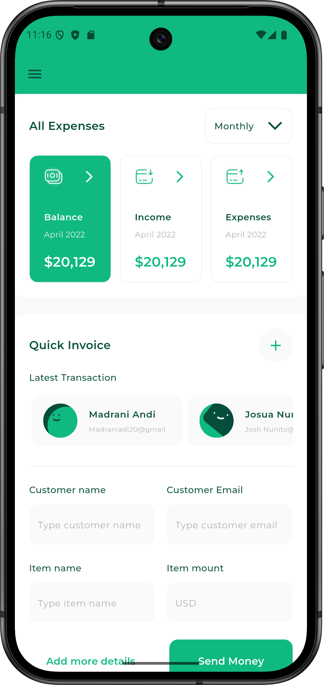
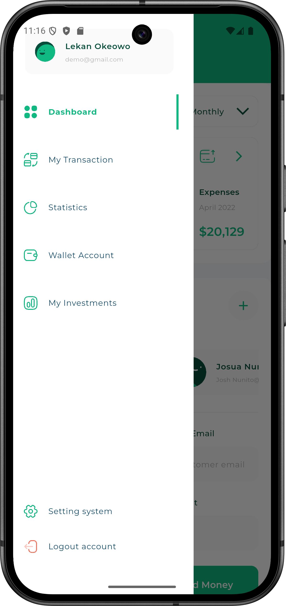
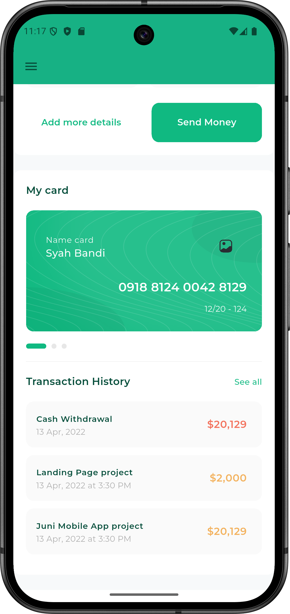
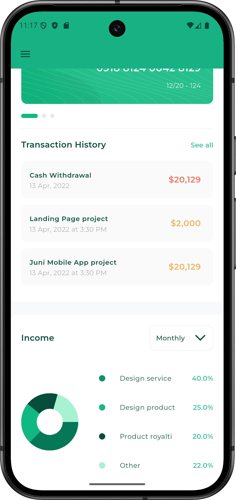
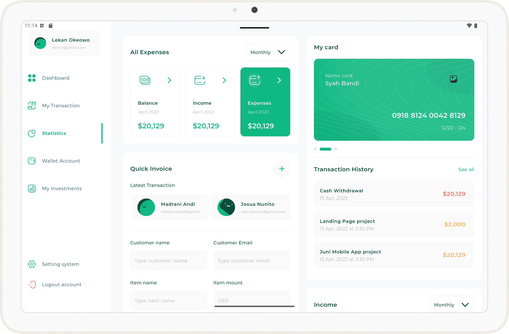
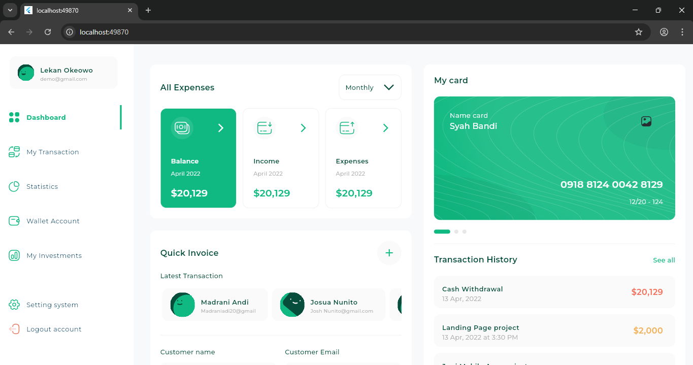
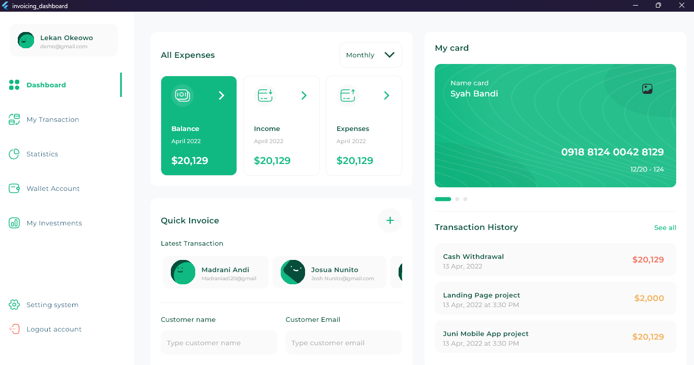

# Invoicing Dashboard
[](https://deepwiki.com/Nidhal-Khazene/Invoicing-Dashboard)

A responsive and adaptive invoicing dashboard application built with Flutter. This project demonstrates a complex UI that adapts seamlessly across mobile, tablet, and desktop screen sizes, providing a comprehensive user experience for managing finances and invoices.

## Website Live


## Features

-   **Fully Responsive Layout**: The user interface is built using an adaptive layout that provides an optimal viewing experience for mobile, tablet, and desktop devices.
-   **Interactive Dashboard**: A central dashboard view that consolidates key financial sections:
    -   **All Expenses**: An interactive section to view and filter expenses.
    -   **Quick Invoice**: A streamlined form for creating and sending invoices on the fly.
    -   **My Cards & Transactions**: A visually appealing card management section with a swipeable interface and a detailed transaction history log.
    -   **Income Analytics**: An income section with interactive pie charts to visualize financial data, powered by the `fl_chart` package.
-   **Custom Widgets**: A rich library of custom widgets for buttons, text fields, containers, and list tiles to ensure a consistent and polished UI.
-   **Navigation Drawer**: A clean and functional navigation drawer for easy access to different parts of the application.

## 📱 Screenshots

### 🟩 **Mobile Views**

|                    Expenses and Quick Invoice Screen                     |                              Drawer Screen                               | 
|:------------------------------------------------------------------------:|:------------------------------------------------------------------------:| 
|  |  |  

|                               Card Screen                                |                          Transaction and Income                          | 
|:------------------------------------------------------------------------:|:------------------------------------------------------------------------:| 
|  |  |  

---

### 💻 **Tablet View**

<p align="center">
  
</p>

---

### 🌐 **Web View**

<p align="center">
  
</p>

---

### 🖥️ **Desktop View**

<p align="center">
  
</p>


## Tech Stack

-   **Framework**: Flutter
-   **Language**: Dart
-   **Key Packages**:
    -   `fl_chart`: For creating beautiful and interactive charts.
    -   `expandable_page_view`: Used for the dynamic page view in the "My Cards" section.
    -   `flutter_svg`: For rendering high-quality SVG icons.
    -   `device_preview`: To facilitate the development and testing of responsive layouts.

## Project Structure

The project is organized with a clear and scalable structure:

-   `lib/views`: Contains the main screens or views of the application, such as `DashboardView`.
-   `lib/widgets`: Houses all the reusable UI components that make up the different sections of the dashboard.
-   `lib/utils`: Includes utility files for application styles (`app_styles.dart`), image asset management (`images.dart`), and size configurations (`size_config.dart`).
-   `lib/models`: Data models used throughout the application are defined alongside their respective widgets (e.g., `all_expenses_item_model.dart`).
-   `lib/constants.dart`: Stores app-wide constants like colors and font families.
-   `assets/`: Contains static assets like fonts and SVG icons.

## Getting Started

To get a local copy up and running, follow these simple steps.

### Prerequisites

Ensure you have the Flutter SDK installed on your machine. For installation instructions, see the [official Flutter documentation](https://flutter.dev/docs/get-started/install).

### Installation & Setup

1.  Clone the repository:
    ```sh
    git clone https://github.com/Nidhal-Khazene/Invoicing-Dashboard.git
    ```
2.  Navigate to the project directory:
    ```sh
    cd Invoicing-Dashboard
    ```
3.  Install the dependencies:
    ```sh
    flutter pub get
    ```

### Running the Application

Execute the following command to run the application on your connected device or emulator:
```sh
flutter run
```

## License

This project is licensed under the MIT License. See the [LICENSE](LICENSE) file for more details.